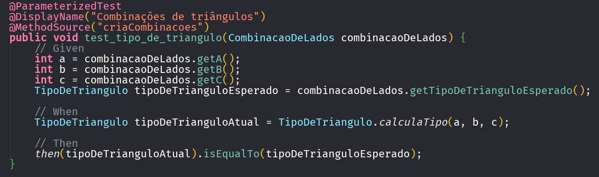
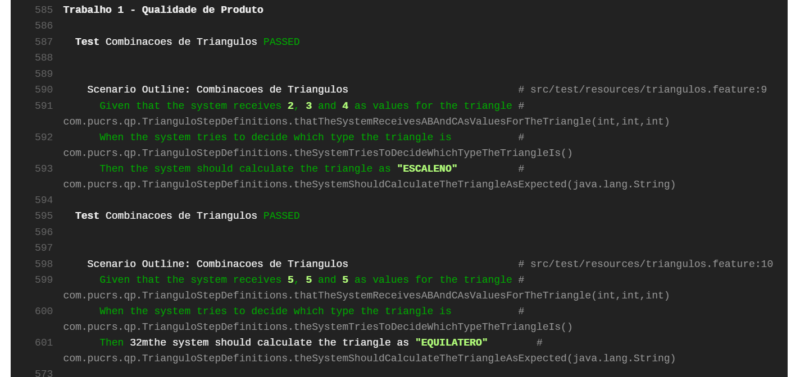
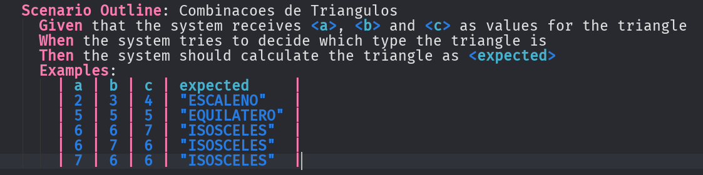
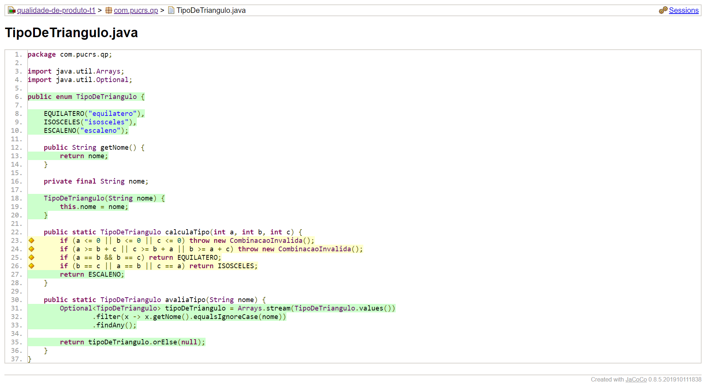

# T1: Qualidade de Produto 

### Stack:
- **Java:** Tecnologia sugerida.
- **JUnit 5 + Parameterized Tests:** Permitem que um teste rode para mais de um valor, possibilitando uma maior flexibilidade para mudanças futuras no código.

Exemplo extraído da classe de testes.

- **Cucumber + Scenario Outline:** Testes que utilizam a documentação escrita em Gherkin, facilitando entendimento de pessoas não-TI. Scenario outline permite que, a cada nova linha nos exemplos, seja gerado um cenário a mais na execução dos testes. 

Imagem extraída dos logs do Travis.

Feature file localizado no projeto.

- **AssertJ:** Biblioteca que implementa asserções mais "fluentes", nesse caso foi utilizada a versão BDD.
- **Jacoco:** Ao fim dos testes, é gerado um relatório que detalhe a cobertura de testes da aplicação.

